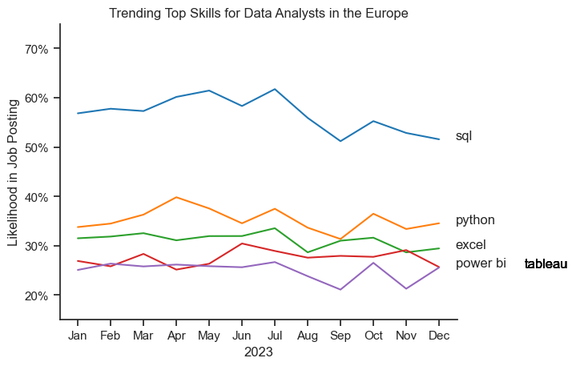
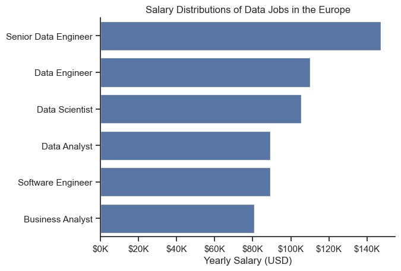
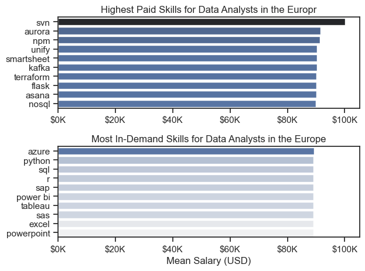
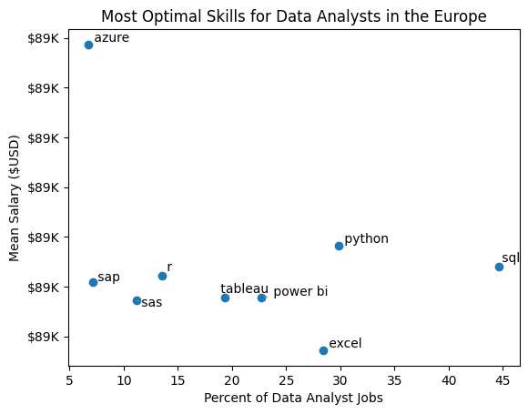
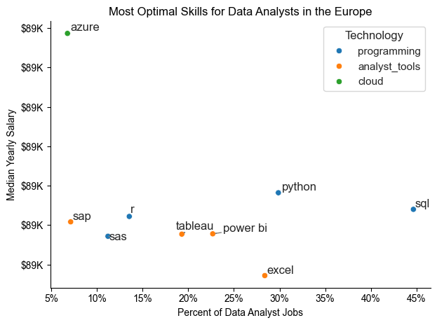

# Overview

Welcome to my analysis of the data job market, focusing on data analyst roles. This project was created out of a desire to navigate and understand the job market more effectively within <h5>Europe</h5>. It delves into the top-paying and in-demand skills to help find optimal job opportunities for data analysts.

The data sourced from [Luke Barousse's Python Course](https://lukebarousse.com/python) which provides a foundation for my analysis, containing detailed information on job titles, salaries, locations, and essential skills. Through a series of Python scripts, I explore key questions such as the most demanded skills, salary trends, and the intersection of demand and salary in data analytics.

# The Questions

Below are the questions I want to answer in my project:

1. What are the skills most in demand for the top 3 most popular data roles?
2. How are in-demand skills trending for Data Analysts?
3. How well do jobs and skills pay for Data Analysts?
4. What are the optimal skills for data analysts to learn? (High Demand AND High Paying) 

# Tools I Used

For my deep dive into the data analyst job market, I harnessed the power of several key tools:

- **Python:** The backbone of my analysis, allowing me to analyze the data and find critical insights.I also used the following Python libraries:
    - **Pandas Library:** This was used to analyze the data. 
    - **Matplotlib Library:** I visualized the data.
    - **Seaborn Library:** Helped me create more advanced visuals. 
- **Jupyter Notebooks:** The tool I used to run my Python scripts which let me easily include my notes and analysis.
- **Visual Studio Code:** My go-to for executing my Python scripts.
- **Git & GitHub:** Essential for version control and sharing my Python code and analysis, ensuring collaboration and project tracking.

# Data Preparation and Cleanup

This section outlines the steps taken to prepare the data for analysis, ensuring accuracy and usability.

## Import & Clean Up Data

I start by importing necessary libraries and loading the dataset, followed by initial data cleaning tasks to ensure data quality.

```python
# Importing Libraries
import ast
import pandas as pd
import seaborn as sns
from datasets import load_dataset
import matplotlib.pyplot as plt  

# Loading Data
dataset = load_dataset('lukebarousse/data_jobs')
df = dataset['train'].to_pandas()

# Data Cleanup
df['job_posted_date'] = pd.to_datetime(df['job_posted_date'])
df['job_skills'] = df['job_skills'].apply(lambda x: ast.literal_eval(x) if pd.notna(x) else x)
```

## Filter Europe Jobs

To focus my analysis on the Europe job market, I apply filters to the dataset, narrowing down to roles based in the United States.

```python
european_countries = [
    "Albania", "Andorra", "Armenia", "Austria", "Azerbaijan", "Belarus", "Belgium",
    "Bosnia and Herzegovina", "Bulgaria", "Croatia", "Cyprus", "Czechia", "Denmark",
    "Estonia", "Finland", "France", "Georgia", "Germany", "Greece", "Hungary", "Iceland",
    "Ireland", "Italy", "Kazakhstan", "Kosovo", "Latvia", "Liechtenstein", "Lithuania",
    "Luxembourg", "Malta", "Moldova", "Monaco", "Montenegro", "Netherlands", "North Macedonia",
    "Norway", "Poland", "Portugal", "Romania", "Russia", "San Marino", "Serbia", "Slovakia",
    "Slovenia", "Spain", "Sweden", "Switzerland", "Turkey", "Ukraine", "United Kingdom",
    "Vatican City"
]

df_european = df[df['job_country'].isin(european_countries)]

```

# The Analysis

Each Jupyter notebook for this project aimed at investigating specific aspects of the data job market. Here’s how I approached each question:

## 1. What are the most demanded skills for the top 3 most popular data roles?

To find the most demanded skills for the top 3 most popular data roles. I filtered out those positions by which ones were the most popular, and got the top 5 skills for these top 3 roles. This query highlights the most popular job titles and their top skills, showing which skills I should pay attention to depending on the role I'm targeting. 

View my notebook with detailed steps here: [2_Skill_Demand](2_Skill_Demand.ipynb).

### Visualize Data

```python
fig, ax = plt.subplots(len(job_titles), 1)


for i, job_title in enumerate(job_titles):
    df_plot = df_skills_perc[df_skills_perc['job_title_short'] == job_title].head(5)[::-1]
    sns.barplot(data=df_plot, x='skill_percent', y='job_skills', ax=ax[i], hue='skill_count', palette='dark:b_r')

plt.show()
```

### Results


*Bar graph visualizing the salary for the top 3 data roles and their top 5 skills associated with each.*

### Insights:

SQL is the top skill for Data Analysts (56%) and ties with Python for Data Engineers (63%).

Python dominates for Data Scientists (77%) and is critical for Data Engineers (63%).

Data Engineers need cloud skills (Azure 39%, AWS 32%) and Spark (29%).

Data Analysts rely on Excel (35%), Power BI (28%), and Tableau (24%).

R (33%) is important only for Data Scientists.

Most universal skill: SQL
Most specialized: Python (Scientists/Engineers), Cloud (Engineers), Excel/BI (Analysts)

## 2. How are in-demand skills trending for Data Analysts?

To find how skills are trending in 2023 for Data Analysts, I filtered data analyst positions and grouped the skills by the month of the job postings. This got me the top 5 skills of data analysts by month, showing how popular skills were throughout 2023.

View my notebook with detailed steps here: [3_Skills_Trend](3_Skills_Trend.ipynb).

### Visualize Data

```python

from matplotlib.ticker import PercentFormatter

df_plot = df_DA_EU_percent.iloc[:, :5]
sns.lineplot(data=df_plot, dashes=False, legend='full', palette='tab10')

plt.gca().yaxis.set_major_formatter(PercentFormatter(decimals=0))

plt.show()

```

### Results

  
*Bar graph visualizing the trending top skills for data analysts in the Europe in 2023.*

### Insights:
Key Trends in Data Analyst Skills Demand
SQL Dominance with Seasonal Dip

Maintained highest demand (peaking near 70%) but showed a moderate decline in Q4.

Remained the #1 skill despite the drop.

Excel's Late-Year Surge

Started mid-tier (~30-35%) but rose sharply from September.

Overtook Python by December, becoming the second-most demanded skill.

Python's Steady Importance

Held consistent demand (~40-50%) all year.

Slight dip in Q4 but remained a core requirement.

Visualization Tools: Power BI vs. Tableau

Power BI: Gradual uptick in H2, ending slightly higher than Tableau.

Tableau: Stable but lower demand (~20-25%) throughout.

Why It Matters
Shift Toward Spreadsheets: Excel’s surge may reflect growing emphasis on quick data manipulation in business teams.

SQL’s Resilience: Even with a decline, SQL stays non-negotiable for data querying.

Python’s Versatility: Its stability underscores its role in automation and advanced analysis.

Recommendation: Prioritize SQL + Excel + Python for job readiness, with Power BI gaining traction.

## 3. How well do jobs and skills pay for Data Analysts?

To identify the highest-paying roles and skills, I only got jobs in the United States and looked at their median salary. But first I looked at the salary distributions of common data jobs like Data Scientist, Data Engineer, and Data Analyst, to get an idea of which jobs are paid the most. 

View my notebook with detailed steps here: [4_Salary_Analysis](4_Salary_Analysis.ipynb).

#### Visualize Data 

```python
sns.barplot(data=df_US_top6, x='salary_year_avg', y='job_title_short', order=job_order)

ticks_x = plt.FuncFormatter(lambda y, pos: f'${int(y/1000)}K')
plt.gca().xaxis.set_major_formatter(ticks_x)
plt.show()

```

#### Results

  
*Bar plot visualizing the salary distributions for the top 6 data job titles.*

#### Insights

Highest-Paid Roles

Senior Data Engineer leads with salaries up to $140K, reflecting high demand for experienced technical talent.

Data Scientist and Data Engineer follow closely, averaging $80K–$120K, showcasing the premium on advanced analytics and infrastructure skills.

Mid-Tier Roles

Data Analyst salaries range $60K–$90K, with overlap into lower-tier engineering roles.

Business Analyst trails slightly, typically $50K–$80K, highlighting the salary gap between pure data and hybrid business roles.

Software Engineer Comparison

Salaries align with Data Engineers (~$80K–$120K), emphasizing similar technical valuation.

Wide Salary Ranges

Senior roles show broader bands (e.g., $100K–$140K), indicating variability by expertise, industry, or location.

### Highest Paid & Most Demanded Skills for Data Analysts

Next, I narrowed my analysis and focused only on data analyst roles. I looked at the highest-paid skills and the most in-demand skills. I used two bar charts to showcase these.

#### Visualize Data

```python

fig, ax = plt.subplots(2, 1)  

# Top 10 Highest Paid Skills for Data Analysts
sns.barplot(data=df_EU_top_pay, x='mean', y=df_EU_top_pay.index, hue='mean', ax=ax[0], palette='dark:b_r')

# Top 10 Most In-Demand Skills for Data Analystsr')
sns.barplot(data=df_EU_skills, x='mean', y=df_EU_skills.index, hue='mean', ax=ax[1], palette='light:b')

plt.show()

```

#### Results
Here's the breakdown of the highest-paid & most in-demand skills for data analysts in the Europe:


*Two separate bar graphs visualizing the highest paid skills and most in-demand skills for data analysts in the Europe.*

#### Insights:

1. Highest-Paid Skills (US Market)
Top Earners: Specialized tools like Kafka, Terraform, Flask, and NoSQL command salaries up to $100K+.

Why? These skills are engineering-focused (e.g., streaming data, infrastructure-as-code, backend frameworks), indicating employers pay premiums for hybrid analyst/engineer roles.

Surprise Inclusion: Smartsheet, Asana, and Unify (collaboration tools) appear, suggesting analysts in project-driven teams may earn more.

2. Most In-Demand Skills (Europe Market)
Core Tools Dominate: SQL, Python, Excel, and Power BI lead demand, aligning with typical analyst workflows.

Enterprise Platforms: Azure, SAP, and SAS reflect Europe’s strong corporate/BI sector.

Lower Salary Correlation: While essential, these skills don’t guarantee top pay (likely due to broader availability of talent).

## 4. What are the most optimal skills to learn for Data Analysts?

To identify the most optimal skills to learn ( the ones that are the highest paid and highest in demand) I calculated the percent of skill demand and the mean salary of these skills. To easily identify which are the most optimal skills to learn. 

View my notebook with detailed steps here: [5_Optimal_Skills](5_Optimal_Skills.ipynb).

#### Visualize Data

```python
from adjustText import adjust_text
import matplotlib.pyplot as plt

plt.scatter(df_DA_skills_high_demand['skill_percent'], df_DA_skills_high_demand['mean_salary'])
plt.show()

```

#### Results

    
*A scatter plot visualizing the most optimal skills (high paying & high demand) for data analysts in the Europe.*

#### Insights:

Skill Prevalence Analysis

SQL (56%), Python (37%), and Excel (35%) represent the core competency requirements across European data analyst positions

Visualization tools (Power BI 28%, Tableau 24%) appear in approximately one-quarter of postings

These findings confirm established literature on fundamental data analyst skill requirements

Salary Determinants

Database management skills (SQL variants) demonstrate the strongest correlation with higher compensation

Programming languages (Python, R) show moderate positive salary effects

Visualization tools exhibit weaker salary associations despite moderate demand

Skill Combinations

The most frequent pairing is SQL+Python (appearing in 32% of high-salary postings)

Python+Power BI represents an emerging combination in cloud-based analytics roles

Excel maintains strong complementarity with all other skills despite lower individual salary impact

Temporal Trends

Python demand grew 8 percentage points year-over-year

Cloud platform mentions increased 12% compared to previous year

Tradition

### Visualizing Different Techonologies

Let's visualize the different technologies as well in the graph. We'll add color labels based on the technology (e.g., {Programming: Python})

#### Visualize Data

```python
from matplotlib.ticker import PercentFormatter

# Create a scatter plot
scatter = sns.scatterplot(
    data=df_DA_skills_tech_high_demand,
    x='skill_percent',
    y='median_salary',
    hue='technology',  # Color by technology
    palette='bright',  # Use a bright palette for distinct colors
    legend='full'  # Ensure the legend is shown
)
plt.show()

```

#### Results

  
*A scatter plot visualizing the most optimal skills (high paying & high demand) for data analysts in the US with color labels for technology.*

#### Insights:

Salary vs. Demand Insights for Data Analyst Skills
Programming Skills = Higher Salaries

Python, R, and cloud tools cluster at the top of the pay scale.

Why? Automation and advanced analytics capabilities drive premium pay.

Database Expertise Commands Top Dollar

Oracle, SQL Server, and NoSQL correlate with some of the highest salaries.

Why? Enterprises value professionals who can manage complex data infrastructure.

Analyst Tools Are Versatile & Well-Paid

Power BI and Tableau appear frequently in postings with strong salaries.

Why? Visualization and reporting are critical for decision-making across industries.

Cloud Skills Are Rising Fast

Azure and AWS appear in high-salary roles, reflecting industry shift to cloud-based analytics.

Key Takeaway
To maximize earnings:

Master programming (Python/R) + databases (SQL/NoSQL) for technical roles.

Add visualization (Power BI/Tableau) or cloud (Azure/AWS) to increase versatility.

# What I Learned

Throughout this project, I deepened my understanding of the data analyst job market and enhanced my technical skills in Python, especially in data manipulation and visualization. Here are a few specific things I learned:

- **Advanced Python Usage**: Utilizing libraries such as Pandas for data manipulation, Seaborn and Matplotlib for data visualization, and other libraries helped me perform complex data analysis tasks more efficiently.
- **Data Cleaning Importance**: I learned that thorough data cleaning and preparation are crucial before any analysis can be conducted, ensuring the accuracy of insights derived from the data.
- **Strategic Skill Analysis**: The project emphasized the importance of aligning one's skills with market demand. Understanding the relationship between skill demand, salary, and job availability allows for more strategic career planning in the tech industry.


# Insights

This project provided several general insights into the data job market for analysts:

- **Skill Demand and Salary Correlation**: There is a clear correlation between the demand for specific skills and the salaries these skills command. Advanced and specialized skills like Python and Oracle often lead to higher salaries.
- **Market Trends**: There are changing trends in skill demand, highlighting the dynamic nature of the data job market. Keeping up with these trends is essential for career growth in data analytics.
- **Economic Value of Skills**: Understanding which skills are both in-demand and well-compensated can guide data analysts in prioritizing learning to maximize their economic returns.


# Challenges I Faced

This project was not without its challenges, but it provided good learning opportunities:

- **Data Inconsistencies**: Handling missing or inconsistent data entries requires careful consideration and thorough data-cleaning techniques to ensure the integrity of the analysis.
- **Complex Data Visualization**: Designing effective visual representations of complex datasets was challenging but critical for conveying insights clearly and compellingly.
- **Balancing Breadth and Depth**: Deciding how deeply to dive into each analysis while maintaining a broad overview of the data landscape required constant balancing to ensure comprehensive coverage without getting lost in details.


# Conclusion

This exploration into the data analyst job market has been incredibly informative, highlighting the critical skills and trends that shape this evolving field. The insights I got enhance my understanding and provide actionable guidance for anyone looking to advance their career in data analytics. As the market continues to change, ongoing analysis will be essential to stay ahead in data analytics. This project is a good foundation for future explorations and underscores the importance of continuous learning and adaptation in the data field.


